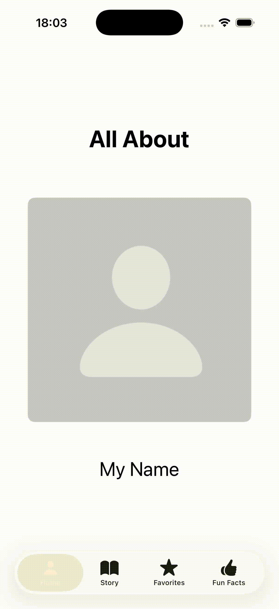

# Rock Brownfield example

This is a simple example of how to use Brownfield with React Native. The app was initialized with `npm create rock@latest` command with `brownfield-ios` plugin.

## Features

- SwiftUI app: [About Me](/About%20Me/)
- React Native app: [Hello Brownfield](/Hello%20Brownfield/)

The `About Me` app is a SwiftUI app displaying four tabs, with second tab "Story" displaying the `HelloBrownfield` React Native app, while the other tabs are native SwiftUI views.

<div align="center">
  
</div>

## Running the apps

The About Me app includes 3 framework files generated from the `HelloBrownfield` project:

- hermes.xcframework - JavaScript runtime
- ReactBrownfield.xcframework - React Native Brownfield library
- HelloBrownfieldReact.xcframework - Your framework target

These frameworks are located in the `HelloBrownfield/.rock/cache/ios/package` directory, which is populated by Rock framework, and **you'll need to build them first** before consuming the app.

### Package React Native app as a framework

Make sure to install depedencies in the `HelloBrownfield` directory:

```
npm install
```

and then package the app using the following command:

```
npm run package:ios
```

### Run the SwiftUI app

Once the frameworks are generated, you can open the `About Me` app in Xcode and run the project.
